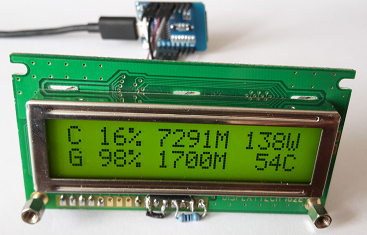

# ESP8266 LCD HWiNFO Client

## Screenshot

## Displaytech 162B pins:
PIN	| FUN
   -|:-
1	| A = 5V + 10 ohm
2	| K = GND
3	| VSS = GND
4	| VDD = 5V
5	| V0 = GND
6	| RS
7	| RW = GND
8	| EN
9	| -
10	| -
11	| -
12	| -
13	| DB4
14	| DB5
15	| DB6
16	| DB7